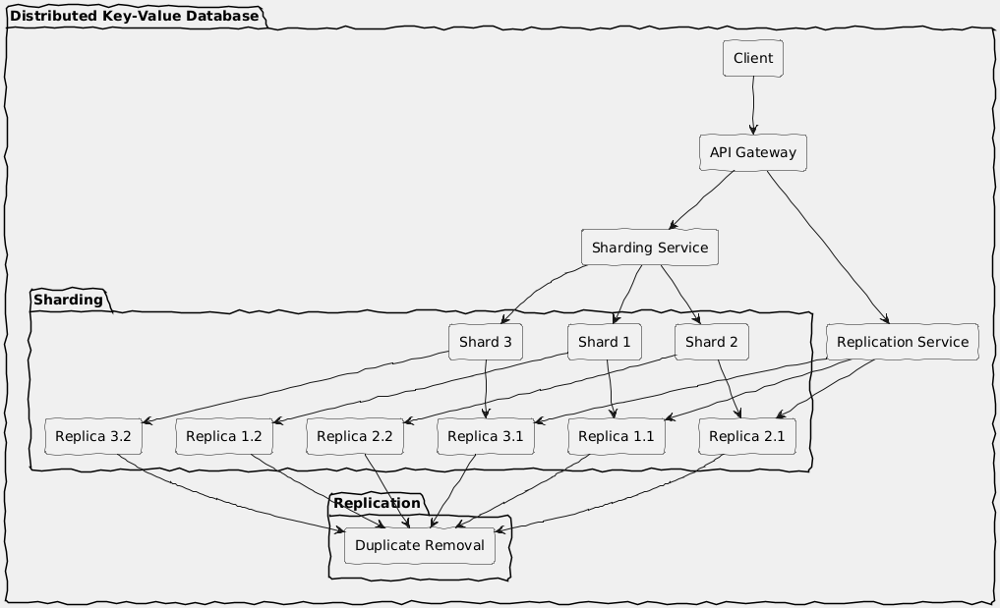

# Distributed Key-Value Database

## Description

The Distributed Key-Value Database is a scalable, fault-tolerant key-value store implemented in Go. It is designed to handle large amounts of data across multiple nodes while providing high availability and performance. This project demonstrates key features such as sharding, replication, and multithreading to ensure efficient data storage and retrieval.

> Check out the [blog post](https://medium.com/@ravikishan63392/from-theory-to-practice-developing-a-distributed-key-value-database-with-sharding-and-replication-541dfef74fec) for a detailed explanation of the project.

## Features

- **Distributed Architecture**: Supports multiple nodes for data distribution and redundancy.
- **Sharding**: Distributes data across different nodes to optimize performance and storage.
- **Replication**: Ensures data durability and availability by maintaining copies across nodes.
- **Multithreading**: Utilizes goroutines for concurrent data access and processing.
- **Optimized Search**: Built-in indexing for fast key lookups and retrieval.



## Getting Started

### Prerequisites

- Go (version 1.16 or higher)
- Make

### Installation

1. Clone the repository:
   ```bash
   git clone https://github.com/Ravikisha/Distributed-KV-Database.git
   cd Distributed-KV-Database
   ```

2. Build the project:
   ```bash
   go build
   ```

3. Run the application:
   ```bash
   $ ./launch.sh
   ```

### Configuration

The database configuration can be adjusted in the `sharding.toml` file. Modify parameters such as the number of shards, replication factors, and node addresses as needed.

## Usage

You can interact with the database using HTTP API endpoints. Below are a few examples:

- **PUT** a key-value pair:
  ```bash
  curl -X PUT http://localhost:8080/set?key=exampleKey&value=exampleValue
  ```

- **GET** a value by key:
  ```bash
  curl http://localhost:8080/get?key=exampleKey
  ```
## Contributing

Contributions are welcome! Please open an issue or submit a pull request.

## License

This project is licensed under the MIT License - see the [LICENSE](LICENSE) file for details.